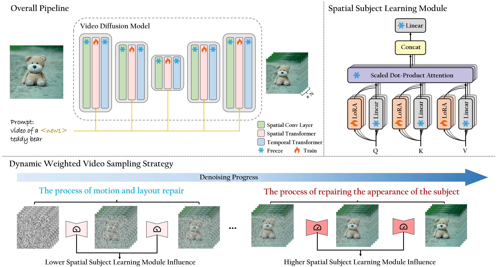

<div align="center">

# ✨CustomCrafter✨

**CustomCrafter: Customized Video Generation with Preserving Motion and Concept Composition Abilities**

<div align="center">
</img>


<a href='https://arxiv.org/abs/2408.13239'></a> &nbsp;&nbsp;&nbsp;&nbsp;<a href='https://customcrafter.github.io/'></a> 
</div>


## 🥳 Demo


Please check more demo videos at the [project page](https://customcrafter.github.io/).

## 🔆 Abstract

> Customized video generation aims to generate high-quality videos guided by text prompts and subject's reference images. However, since it is only trained on static images, the fine-tuning process of subject learning disrupts abilities of video diffusion models (VDMs) to combine concepts and generate motions. To restore these abilities, some methods use additional video similar to the prompt to fine-tune or guide the model. This requires frequent changes of guiding videos and even re-tuning of the model when generating different motions, which is very inconvenient for users. In this paper, we propose CustomCrafter, a novel framework that preserves the model's motion generation and conceptual combination abilities without additional video and fine-tuning to recovery. For preserving conceptual combination ability, we design a plug-and-play module to update few parameters in VDMs, enhancing the model's ability to capture the appearance details and the ability of concept combinations for new subjects. For motion generation, we observed that VDMs tend to restore the motion of video in the early stage of denoising, while focusing on the recovery of subject details in the later stage. Therefore, we propose Dynamic Weighted Video Sampling Strategy. Using the pluggability of our subject learning modules, we reduce the impact of this module on motion generation in the early stage of denoising, preserving the ability to generate motion of VDMs. In the later stage of denoising, we restore this module to repair the appearance details of the specified subject, thereby ensuring the fidelity of the subject's appearance. Experimental results show that our method has a significant improvement compared to previous methods.

## 😉 Pipline



## 📭Citation

If you find CustomCrafter helpful to your research, please cite our paper:
```
@article{wu2024customcrafter,
  title={CustomCrafter: Customized Video Generation with Preserving Motion and Concept Composition Abilities},
  author={Wu, Tao and Zhang, Yong and Wang, Xintao and Zhou, Xianpan and Zheng, Guangcong and Qi, Zhongang and Shan, Ying and Li, Xi},
  journal={arXiv preprint arXiv:2408.13239},
  year={2024}
}
