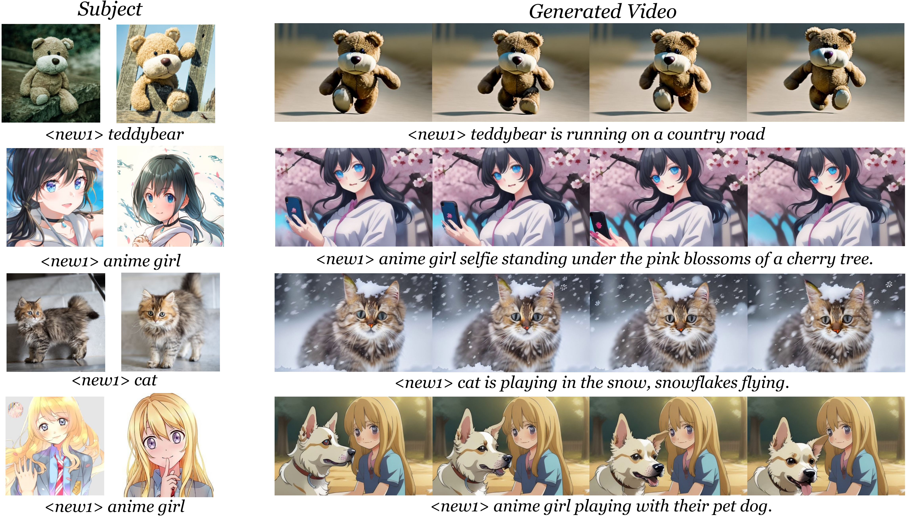
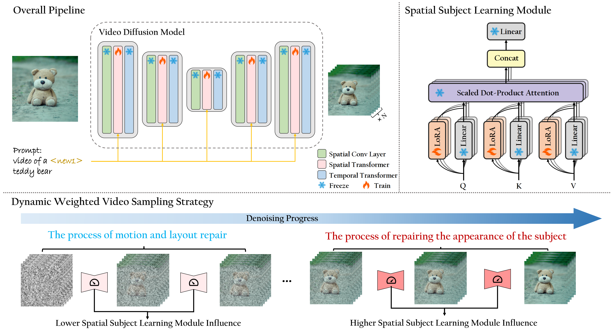

<div align="center">

# ✨CustomCrafter✨

<p><b>CustomCrafter: Customized Video Generation with Preserving Motion and Concept Composition Abilities</b>.</p>

</img>

<a href='https://arxiv.org/abs/2408.13239'></a> &nbsp;
<a href='https://customcrafter.github.io/'></a>  &nbsp;

</div>


## 🥳 Demo



Please check more demo videos at the [project page](https://customcrafter.github.io/).

## 🔆 Abstract

> Customized video generation aims to generate high-quality videos guided by text prompts and subject's reference images. However, since it is only trained on static images, the fine-tuning process of subject learning disrupts abilities of video diffusion models (VDMs) to combine concepts and generate motions. To restore these abilities, some methods use additional video similar to the prompt to fine-tune or guide the model. This requires frequent changes of guiding videos and even re-tuning of the model when generating different motions, which is very inconvenient for users. In this paper, we propose CustomCrafter, a novel framework that preserves the model's motion generation and conceptual combination abilities without additional video and fine-tuning to recovery. For preserving conceptual combination ability, we design a plug-and-play module to update few parameters in VDMs, enhancing the model's ability to capture the appearance details and the ability of concept combinations for new subjects. For motion generation, we observed that VDMs tend to restore the motion of video in the early stage of denoising, while focusing on the recovery of subject details in the later stage. Therefore, we propose Dynamic Weighted Video Sampling Strategy. Using the pluggability of our subject learning modules, we reduce the impact of this module on motion generation in the early stage of denoising, preserving the ability to generate motion of VDMs. In the later stage of denoising, we restore this module to repair the appearance details of the specified subject, thereby ensuring the fidelity of the subject's appearance. Experimental results show that our method has a significant improvement compared to previous methods.

## 📦 Installation

```bash
pip install -r requirements.txt
```

## 🛠️ Preparation
Prepare pretrained VideoCrafter2 weights
```bash
wget https://huggingface.co/VideoCrafter/VideoCrafter2/resolve/main/model.ckpt -o checkpoints/videocrafter2/model.ckpt
```

Prepare regularization data
We provide two ways to obtain regularized image data.
One is to find real images from the LAION dataset as regularization data, but since the LAION dataset is temporarily unavailable(referring to [this](https://github.com/huggingface/diffusers/issues/6880)), it may not work properly.
The other is to use Stable Diffusion2.1 to generate images as regularization data.

```bash
# Real images as regularization data
pip install clip-retrieval
python retrieve.py --class_prompt "cat" --class_data_dir 'datasets/real_reg/samples_cat/' --num_class_images 200

# Generated images as regularization data
python sample_reg.py --prompt "a photo of a cat" -outdir 'datasets/real_reg/samples_cat/' --num 200

```


## 🚀 Trainning
```bash
python -m torch.distributed.run \
    --nproc_per_node=4 --master_port=1234 \
    custom.py \
    --base configs/train_customcrafter.yaml \
    -t --gpus 0,1,2,3 \
    --lora True \
    --resume-from-checkpoint-custom 'checkpoints/videocrafter2/model.ckpt' \
    --caption "<new1> cat" \
    --modifier_token "<new1>" \
    --initializer_token 'cat' \
    --datapath "datasets/example_dataset/pet_cat5/" \
    --reg_datapath "./datasets/real_reg/samples_cat/images.txt" \
    --reg_caption "./datasets/real_reg/samples_cat/caption.txt" \
    --with_prior_preservation True \
    --base_learning_rate 0.00003 \
    --name "Pet_cat5_Videocrafter2_Checkpoints"
```

## 📊 Inference
```bash
MID_STEP=5 # set K in the paper
BEGIN_SCALE=0.4 # set $lambda_s$ in the paper
MID_SCALE=0.8 # set $lambda_l$ in the paper

config=configs/inference_customcrafter.yaml
prompt_file="prompts/cat_prompts.txt"
log_name="your train log dir"
res_dir="outputs/$log_name"
ckpt="logs/$log_name/checkpoints/epoch=000199.ckpt"

python -m torch.distributed.launch \
    --nproc_per_node=1 --master_port=$PORT \
    pipeline/evaluation/ddp_wrapper.py \
    --module 'timestep_inference_lora' \
    --seed 1000 \
    --lora True \
    --ckpt_path $ckpt \
    --base $config \
    --savedir $res_dir \
    --n_samples 1 \
    --bs 1 --height 320 --width 512 \
    --unconditional_guidance_scale 12.0 \
    --ddim_steps 50 \
    --ddim_eta 1.0 \
    --pretrain 'checkpoints/videocrafter2/model.ckpt' \
    --prompt_file $prompt_file \
    --mid_step $MID_STEP \
    --begin_scale $BEGIN_SCALE \
    --mid_scale $MID_SCALE 
```

## 😉 Pipline




## 📭Citation

If you find CustomCrafter helpful to your research, please cite our paper:
```
@article{wu2024customcrafter,
  title={CustomCrafter: Customized Video Generation with Preserving Motion and Concept Composition Abilities},
  author={Wu, Tao and Zhang, Yong and Wang, Xintao and Zhou, Xianpan and Zheng, Guangcong and Qi, Zhongang and Shan, Ying and Li, Xi},
  journal={arXiv preprint arXiv:2408.13239},
  year={2024}
}
